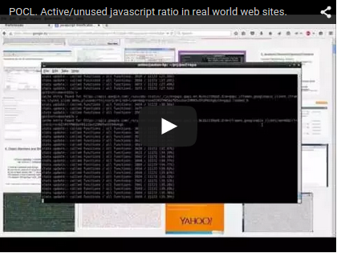
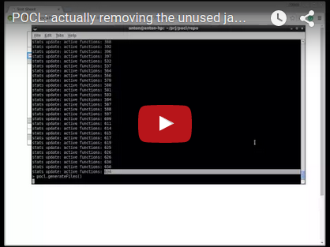

# Predictive Optimizing Code Loading

Study of application acceleration by reducing the size of code to be loaded.

1.1 The minimization is based on statistics of what functions are really invoked at runtime,
and loading only them when the application is started next time. (The rest of the functions
remain available and loaded at first invocation.)

1.2 Initially load only the code used _immediately_ at the application startup
(renders initial UI, load initial data). Other code could be loaded afterwards in background,
or upon some events (user navigates to a certain part of the app).

We study this approach in application to javascript in web applications.

# Results

## What can we save?

By opening real world web applications (Google Docs, github, etc) via
proxy, which instruments their javascript code to record function invocations,
we determined that in an average web application only around 20-45 % of the
javascript functions loaded into the browser are actually called at runtime.

<a href="https://www.youtube.com/watch?v=WooKxSfCOdE" target="_blank"></a>

Tested it also with my web application http://testsheet.biz. This
application uses very small amount of libraries, and is small enough
to invoke every application feature in UI.
Around 47% of JS functions of testsheet.biz are invoked at run-time.

## Actually removing the unused code

We have created a prototype which removes the unused code based on the
function call statistics.

<a href="https://www.youtube.com/watch?v=ciKSqUfdC8k" target="_blank"></a>

It's a javascript-to-javascript compiler, which replaces each unused function
by a stub. The stub, when invoked, first records the fact that it was invoked,
then loads the original function body and executes it. The function calls
statistics is accumulated and uploaded to the POCL server to adjust the code - include only functons seen actually called and remove the rest. Essentially, it implements statistical dead code elimination (1.1).

The prototype assumes all the app javascript is combined into a single file.
Based on call statistics this codebase is separated into
two files: "active" and the "rest":

```
             call statistics
                    |
                    V
                 ┌------┐
myapp.min.js ->  | POCL | -> myapp.min.a.js
                 |      | -> myapp.min.r.js
                 └------┘

```

The web page includes the "active" script:
```html
<script src="myapp.min.a.js"></script>
```

Initially, when there is no call statistics, the "active" file includes all the functions.
As enough statistics is accumulated, the compilation is repeated
and new .a and .r files are generated. Now the .a file only contains
the functions seen invoked. Should any other function be called by the application,
its stub loads the .r file.

This setup allows to employ POCL even for otherwise static web sites.
(TODO: make it possible to include hash codes into file names,
for more reliable work with HTTP cashes, and deployment of new versions
of myapp.min.js file, new versions of POCL)

It was tested on http://testsheet.biz. The original testsheet.min.js file
is generated by Google Closure Compiler. After invoking every app
feature in UI the "active" testsheet.min.a.js file weights 65.89%
of testsheet.min.js.

Taking into account that in testsheet.min.js, of all JS functions
only 50% are used, and that in many other applications only
around 35% of functions are used, we can estimate
that for an average application its code size can be reduced to maybe
50% of the original size.

There overhead in file size comparing to the number of invoked functions
(68% / 50%) is caused by the fact we don't just remove the unused functions,
but replace them with a stub expression, able to load the original function and call it.
Also, if we remove closured, when the original closure body is loaded by the stub,
we need to provide it with access to variable captured by the closure from the surrounding scope.
It requires some code to be injected, therefore adds to the overhead.

# Advantages

- Comparing to dead code elimination based on static analysis,
  POCL results in better minimization even in the simplest implementation  (1.1),
  which loads ALL the code seen to be called at least once.
  Because there are code paths possible in theory, therefore not "dead"
  from the static analysis point of view, but which are never called,
  or rarely called by the application in reality.

- Any javascript code is eligible for this load optimization,
  without the need for any "export" annotations and other restrictions
  (unlike Google Closure Compiler)

This approach can save JS programmers from using and developing libraries
which are "only X kilobytes gzipped" - we could use libraries of large size
but the app only loads what is necessary (and when necessary, if we implement
more intelligent statistics handling).

# Further notes

This approach can be applied not only to Javascript but to other languages
and run-time systems. I originally invented it in 2013 when dreaming
about in-browser Common Lisp implementation.

Not only the application code, but also the standard library of the language could be minimized that way.

- Security
- Privacy
- What to download from the internet, and what to load into any particular web page.
